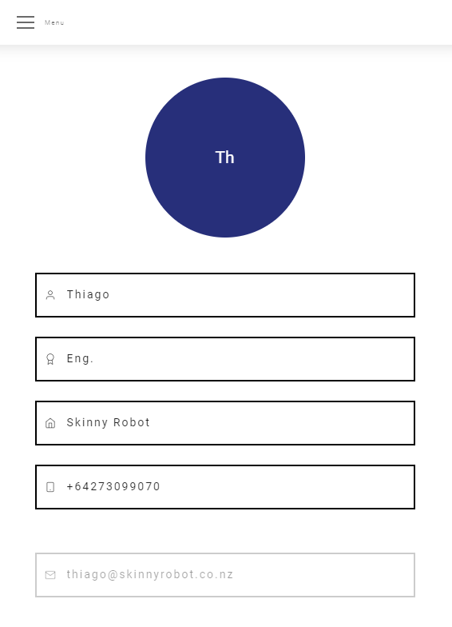
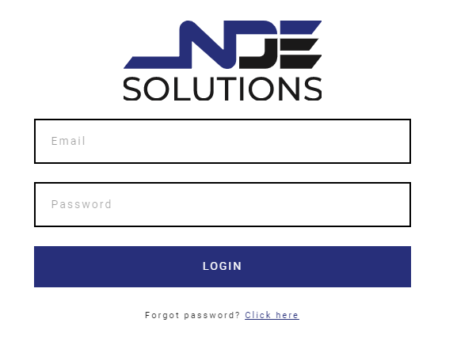

# Your Account

On your account you can find your user name, title, company, telephone and email.

You can edit your personal information, make sure everything is correct.

<template>
     
    <v-card>
         
            

            
            

         
    </v-card>
</template>

:::tip
You can also Upload a picture for your profile
:::

## Recovering Password

As simple as It can be, if you forgot your password just click on the link to recover.

You will receive a link to redefine your password.

<template>
     
    <v-card>
         
            

            
            

         
    </v-card>
</template>