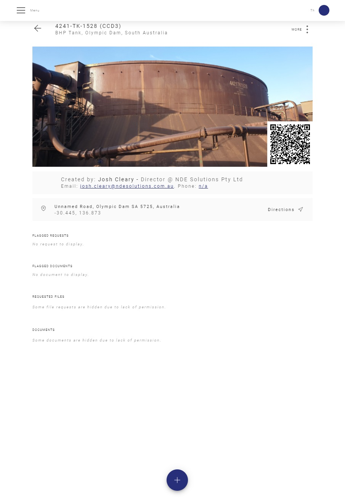
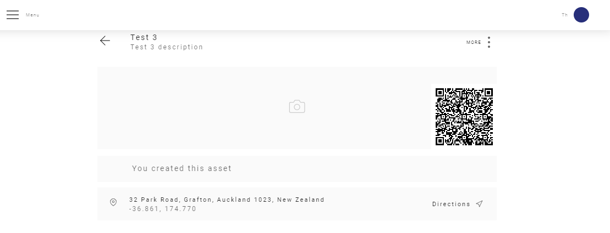
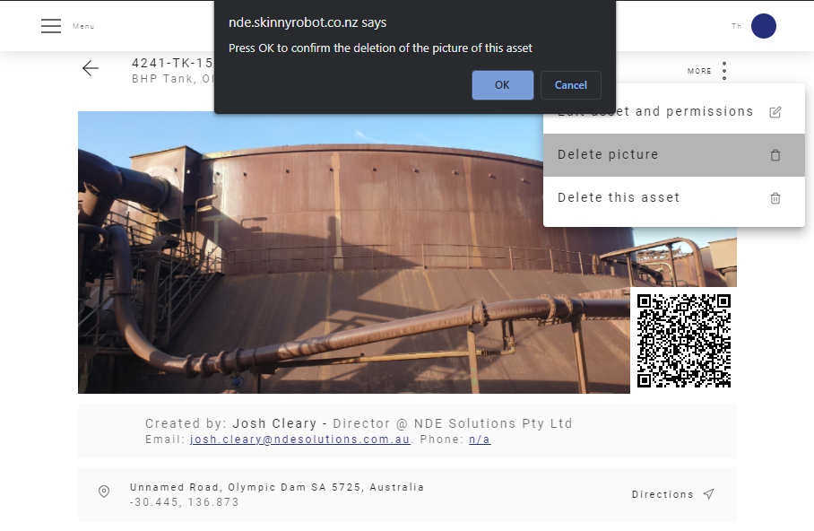
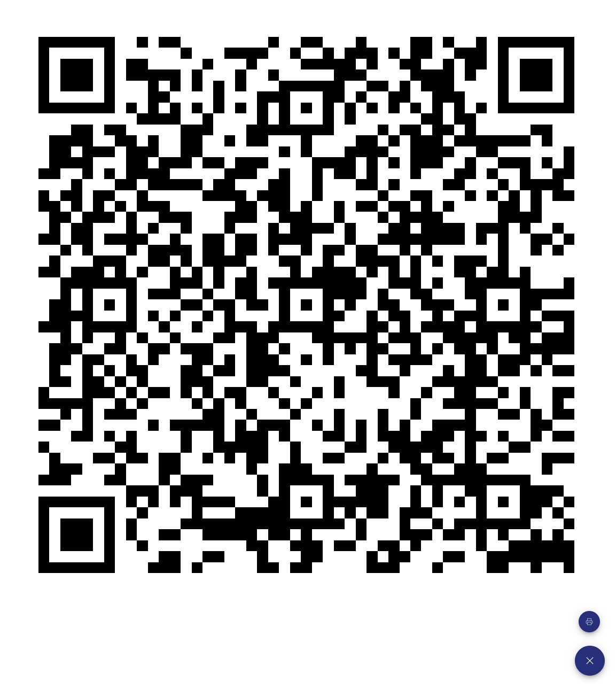
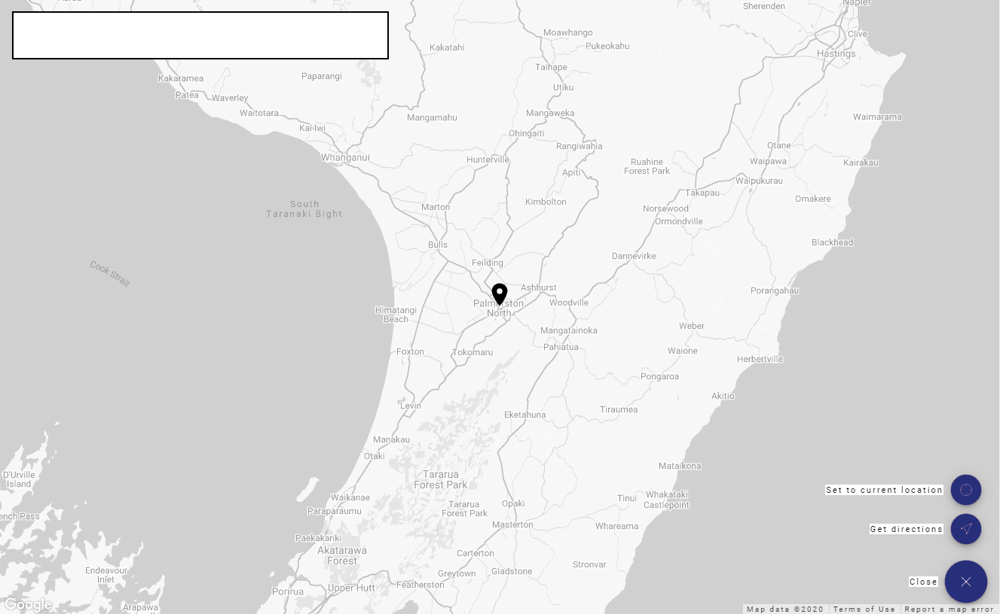

# Asset Page

The Asset Page is where you can find all the related documents of your asset.

<template>
     
    <v-card>
         
            

            
            

         
    </v-card>
</template>

## Asset Photo

You can upload a photo to your asset, just click on the camera icon and choose a picture.

<template>
     
    <v-card>
         
            

            
            

         
    </v-card>
</template>

 

If you already have a picture you can delete the picture using the "More menu" and confirm to delete.

Then you can upload another picture.

<template>
     
    <v-card>
         
            

            
            

         
    </v-card>
</template>

 

:::tip
You can also upload a picture from the General Assets Page. For that just click on the camera icon.
:::

 

Also, if you click on the QR code you are able to print the QR code, give it a try.

<template>
     
    <v-card>
         
            

            
            

         
    </v-card>
</template>

 

## Location

Finding an Asset is very easy an intuitive. 

To set a new location for your asset search the location using the search box, then just click on the map to set the location.

<template>
     
    <v-card>
         
            

            
            

         
    </v-card>
</template>

### Get Directions

You can also get directions for the Asset location, once It's defined. Just click on the Get Directions button on the bottom right corner.

## Flagged Requests and Documents

Refer to [Flag System ](/Flag/) for details on how to flag Requests and Documents.

## Documents

All the Documents that are not flagged will be displayed in this area. You can upload pictures, drawings, safety directions, technical instructions, work packages, JSAs, or anything you want to.
