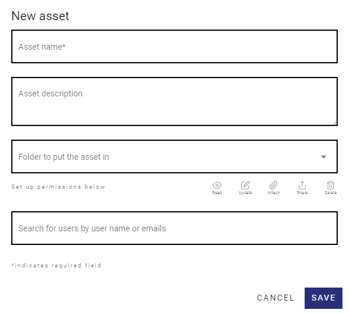

<Noprintmenu/>
<NoPrintSideBar/>

# Creating Assets

Creating Assets is the most basic operation on the BVQR App.

It is also a powerful tool, where you can set an Asset name, description, choose a folder to store your asset and also define permissions and Who is authorized to read, update, attach, share or delete your asset.

 

First click on the + Button on the Assets Page, then Create a New Asset, like the image below.

<template>
     
    <v-card>
         
            

            
            

         
    </v-card>
</template>

 

## New Asset window basics

First, At the New Asset Window you will fill up the Name of the asset, the description and in which folder this asset will be allocated.
You don't need to setup the permissions for the asset right now. This can be done later from the Asset Page on the "More menu".

<template>
     
    <v-card>
         
            

            
            

         
    </v-card>
</template>

:::tip
<strong>Asset name and description</strong>

Choose the Asset name and description carefully, you can search for them on the Assets Page.
:::

## Permissions

An Asset Owner can give permissions to other to execute 5 operations, they are listed and explained below.

### Read

With this permission the user can visualize the document or asset which he has been given permission.

### Update

With the Update permission the user can update a document that is already on the system. For example, updating a report.

### Attach

The Attach permission gives the user the ability to attach files for example to a  [Request File](/FileRequests/). field or to attach a file to the Asset Itself as a new file.

### Share

With this permission the user can share the asset or document which he has been given permission.

### Delete

You can delete a file or asset with this permission.

