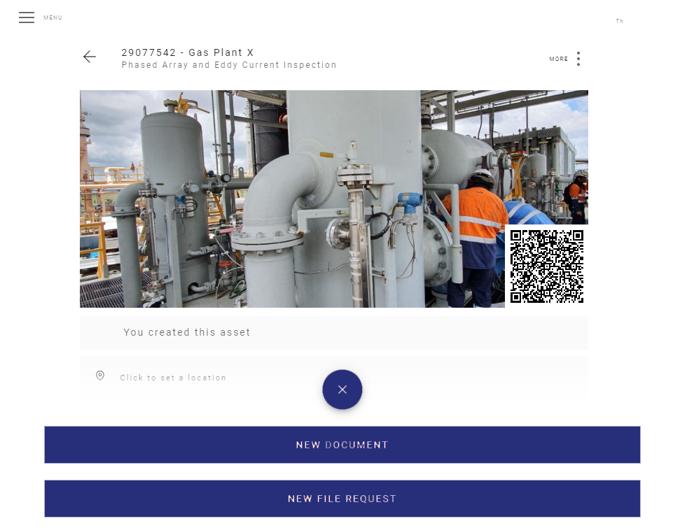
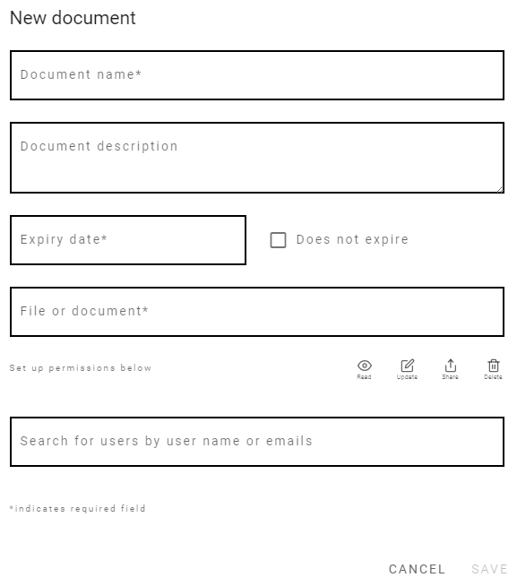

# Documents Page

At the documents page you can see all the documents that you have access.

You can also sort them by flag severity, name or expire date.

If you like you can filter them by flag and you can search for any document at the search bar as well.

<template>
     
    <v-card>
         
            

            
            

         
    </v-card>
</template>

## Documents 

A document can be a photograph, a pdf drawing, a pdf report, a word file, a certificate, etc...

They will be attached to the Asset and only who has permission can have access to them.

You can invite someone to have access to only one document of an Asset if you like, so only relevant information will be shared.

## Creating a New Document

From inside the Asset Page click on the red + button...

<template>
     
    <v-card>
         
            

            
            

         
    </v-card>
</template>

 
Then click on New Document.
 

<template>
     
    <v-card>
         
            

            
            

         
    </v-card>
</template>

 
Now you can see the New Document Window.
 

<template>
     
    <v-card>
         
            

            
            

         
    </v-card>
</template>

:::tip
You can set the permissions now or you can do it later on.
:::