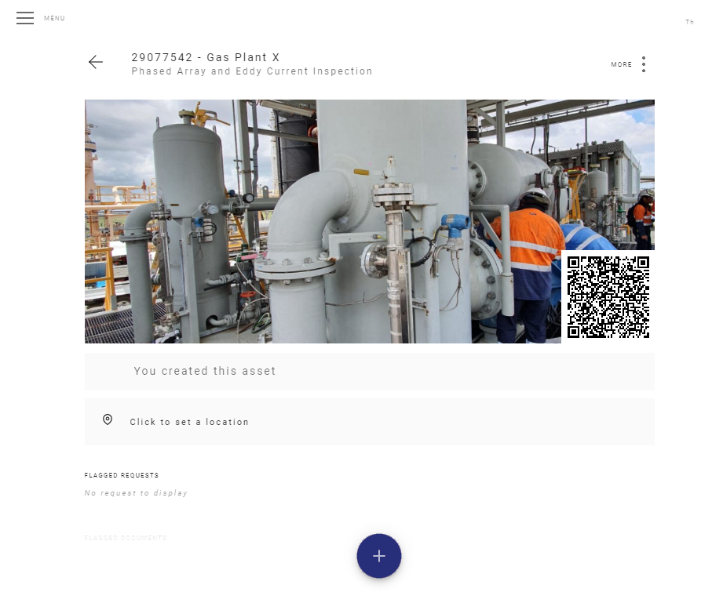
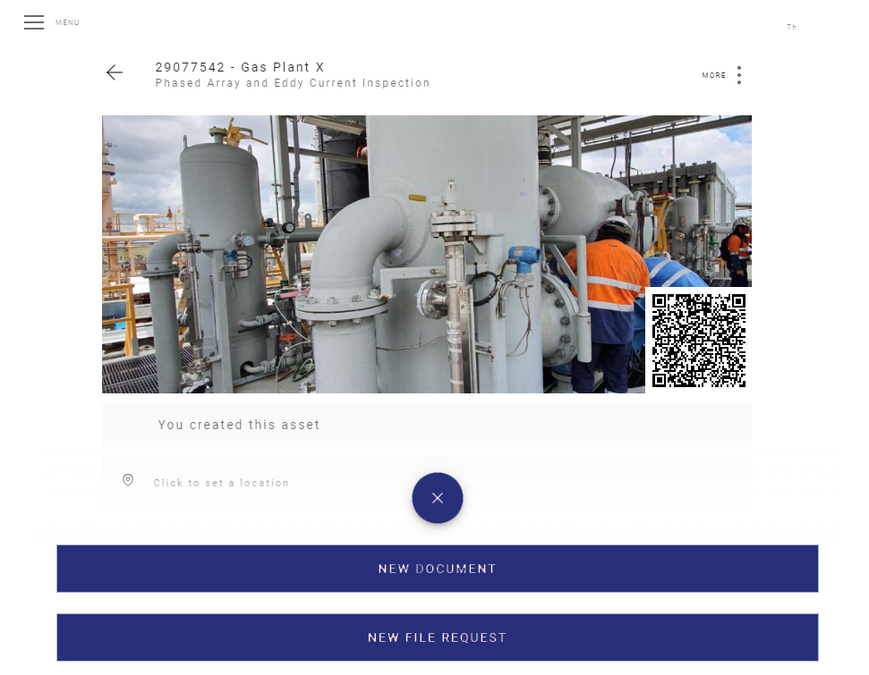
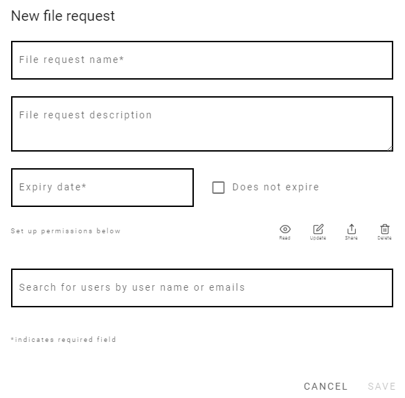
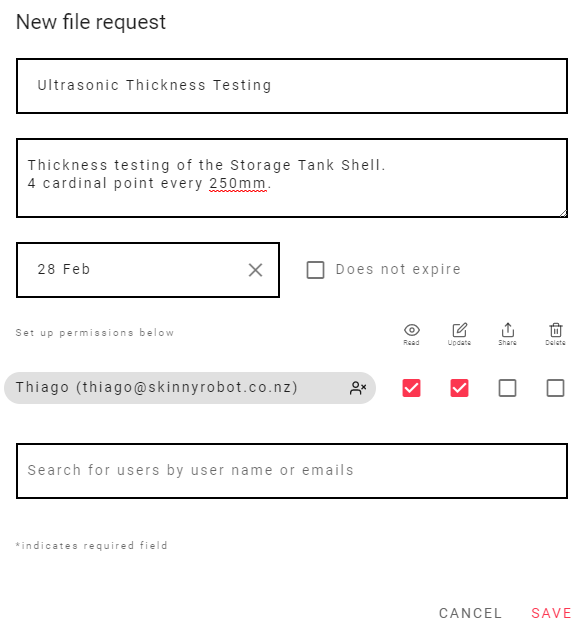
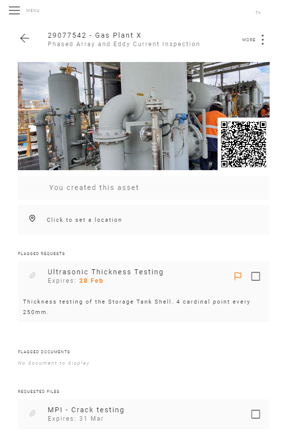
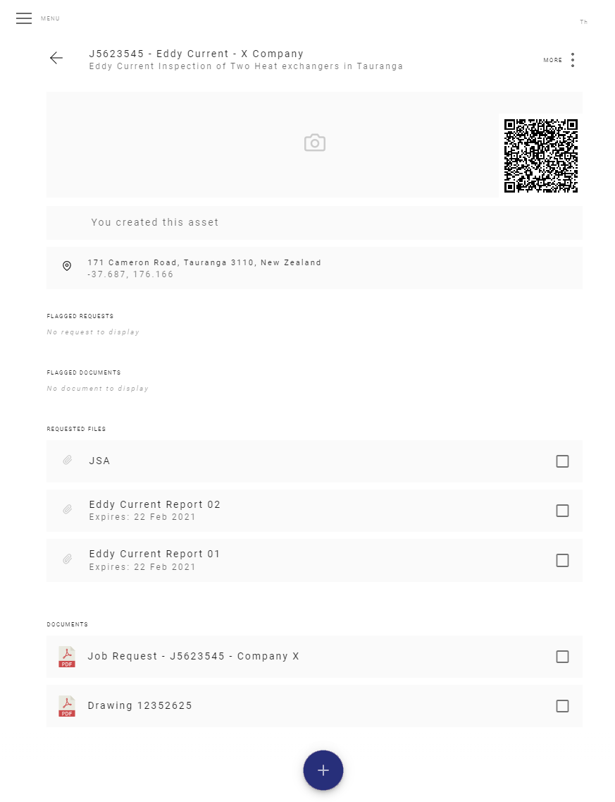

# File Request

A file Request is used to request files for an Asset.   <!--  It's very easy to create a File Request. Click [here](/FileRequests.html#creating-a-new-file-request). to know how. -->

## Creating a New File Request

From inside the Asset Page click on the red + button...

<template>
     
    <v-card>
         
            

            
            

         
    </v-card>
</template>

 
Then click on New File Request.
 

<template>
     
    <v-card>
         
            

            
            

         
    </v-card>
</template>

 
Now you can see the New File Request Window.

Fill up the name, description, expire date and permissions of the requested file.

 

<template>
     
    <v-card>
         
            

            
            

         
    </v-card>
</template>

:::tip
Description and permissions are not mandatory at this moment, you can set it up later
:::

## Useful Examples using File Requests 

This feature is very useful for some applications here are Two Examples

### Creating an Asset for a Tank and requesting documents
 

For example, if you create a new Asset for a Storage Tank and you expect the tank to be inspected for Thickness Testing.

So you can create the Storage Tank Asset and create a request for a Thickness testing report like the picture below.

<template>
     
    <v-card>
         
            

            
            

         
    </v-card>
</template>

 

In this case the inspector Thiago can read and update the document, so when he finishes the inspection he can update the report to the Asset.

:::tip
You can set an expiring date for the document to be uploaded in this example it was the 28th of february.
::::

<template>
     
    <v-card>
         
            

            
            

         
    </v-card>
</template>

 

:::tip
Because the document expires before one month It's flagged as orange, see the Flag System for more information about [flags](/Flag/).
::::

Note that there is a request for an MPI report as well and this one is not flagged because it doesn't expire within one month period.

### Another Example: Creating a Job

 

This job creating can be for an specific equipment on a shutdown or a normal NDT job, or even a statutory job. Use your imagination and this tool can be very handy.

As you can see below, on this example a Job was created for an Eddy Current inspection and some documents are required.

The inspector will have to provide the two Eddy Current reports for the job, the raw data sheets and the JSA as well.

A picture of the subject of inspection can be uploaded as profile of the job.

Some files were also uploaded as documents for reference, in this case was the Job request by the client and the drawings for the Heat Exchangers.

<template>
     
    <v-card>
         
            

            
            

         
    </v-card>
</template>

:::tip
Once this asset is fully complete you just have to pack everything and invoice to the client.
:::