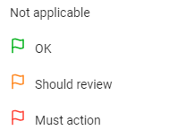
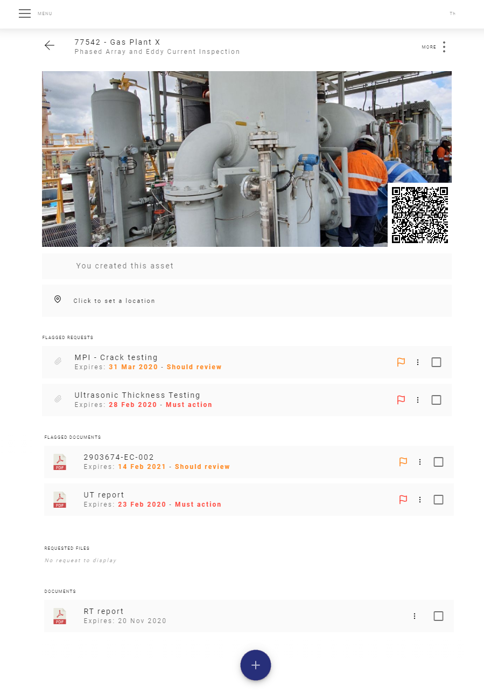
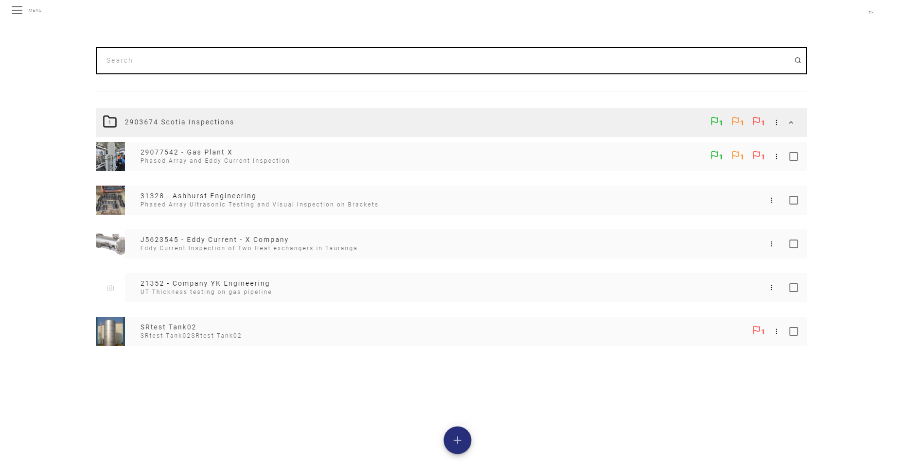
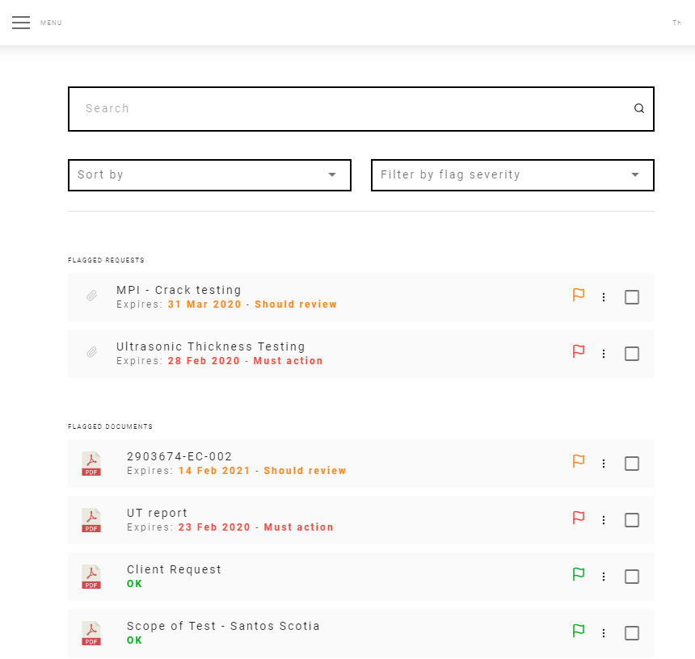

# FLAG System

You can Flag important documents, track expiring dates of certificates, reschedule inspections and let the system point out the important thing so you don't miss anything.

There are three types of flags:

 

* Green - OK

* Yellow - Should Review

* Red - Must Action

 
    

    
    

 

## Automatic flagged documents

Documents with expired date will automatically be flagged with a Red flag.

Documents with one month to expire will automatically be flagged with a Yellow flag.

## Manually flagged documents

With the purpose of highlighting and bring attention to a document you can flag any document with one of the three flags 

<template>
     
    <v-card>
         
            

            
            

         
    </v-card>
</template>

 

The flags are counted and visible on the General Assets Page.

<template>
     
    <v-card>
         
            

            
            

         
    </v-card>
</template>

 

They can also be seen and filtered by on the Documents Page

<template>
     
    <v-card>
         
            

            
            

         
    </v-card>
</template>