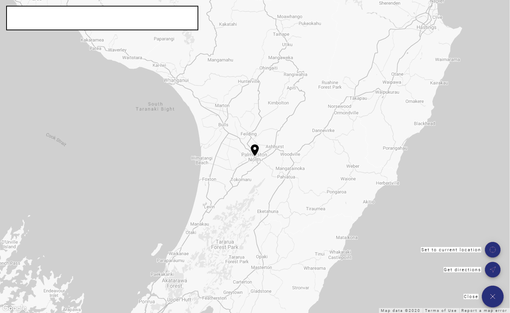

# Map View

At the Map view Page you can find all your assets and with a single click you can go direct to the asset.

<template>
     
    <v-card>
         
            

            
            

         
    </v-card>
</template>

## GPS Location

Finding an Asset is very easy an intuitive. 

To set a new location for your asset search the location using the search box, then just click on the map to set the location.

<template>
     
    <v-card>
         
            

            
            

         
    </v-card>
</template>

### Get Directions

You can also get directions for the Asset location, once It's defined. Just click on the Get Directions button on the bottom right corner.

### Set to current location

Send your current location with your cellphone quick and easy, just click the "Set to current location" button.