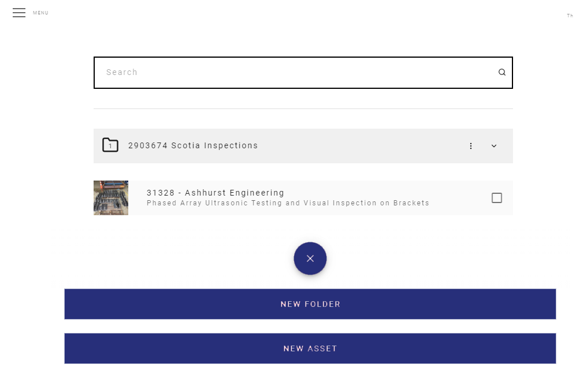
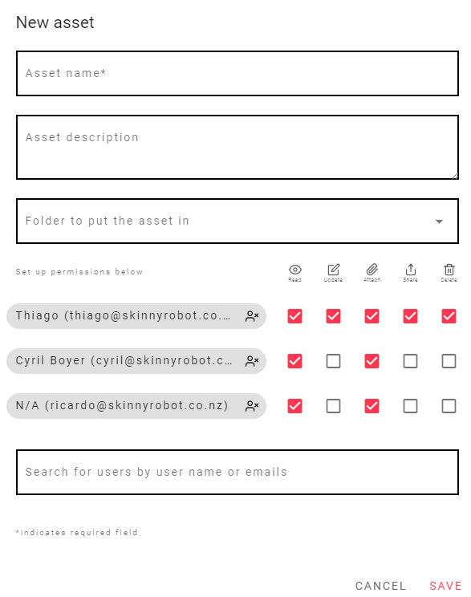
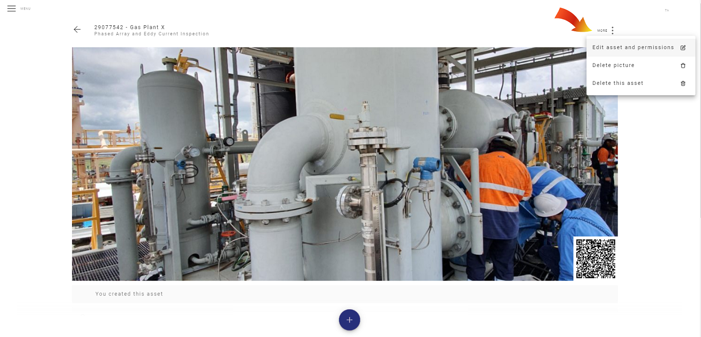
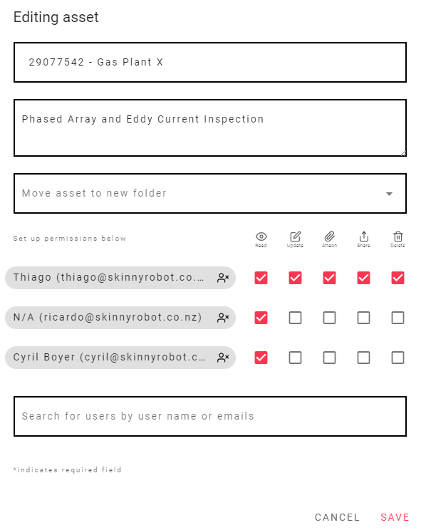
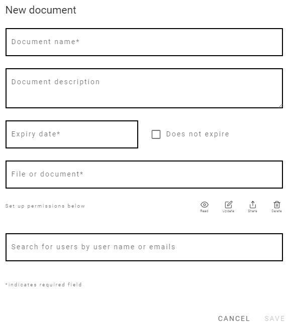

# Permissions

An Asset Owner can give permissions to other to execute 5 operations, they are listed and explained below.

### Read

With this permission the user can visualize the document or asset which he has been given permission.

### Update

With the Update permission the user can update a document that is already on the system. For example, updating a report.

### Attach

The Attach permission gives the user the ability to attach files for example to a  [Request File](/FileRequests/). field or to attach a file to the Asset Itself as a new file.

### Share

With this permission the user can share the asset or document which he has been given permission.

### Delete

You can delete a file or asset with this permission.

## Setting up the permissions

You can setup the permission from various different places, as explained below.

The permissions give the user ability to execute 5 operations: Read, Update, Attach, Share and Delete an asset or document.

## From the New Asset window

First click on the + Button on the Assets Page, then Create a New Asset, like the image below.

<template>
     
    <v-card>
         
            

            
            

         
    </v-card>
</template>

 

At the New Asset window, you can choose what kind of permission and who is going to be allowed.

You can search users by user name or email on the text box.

After you added the user just click on the checkboxes and choose the kind of permission. 

::: tip
You can give permissions to multiple users at the same time.
:::

 

<template>
     
    <v-card>
         
            

            
            

         
    </v-card>
</template>

 

## From the Editing Asset window

You can also access permission from the Editing Asset window

Click on the "More" button on the top right corner, then Edit asset and permissions.

<template>
     
    <v-card>
         
            

            
            

         
    </v-card>
</template>

 

Now just and the users and click on the checkboxes and choose the kind of permission.

<template>
     
    <v-card>
         
            

            
            

         
    </v-card>
</template>

## From the New Document window

Another way to setup the permissions is When you are creating a new document inside the Asset Page.

<template>
     
    <v-card>
         
            

            
            

         
    </v-card>
</template>

:::tip
Setting up the permissions is very easy and simple, just choose the person by name or email and check the boxes of what permissions they are allowed.
:::

