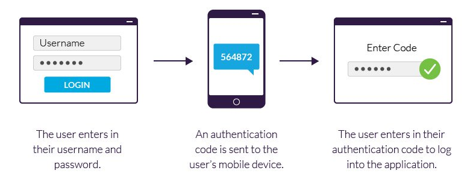
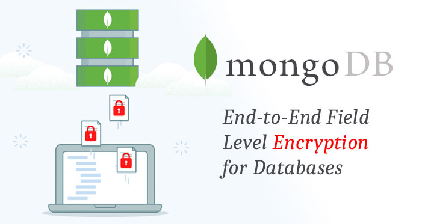
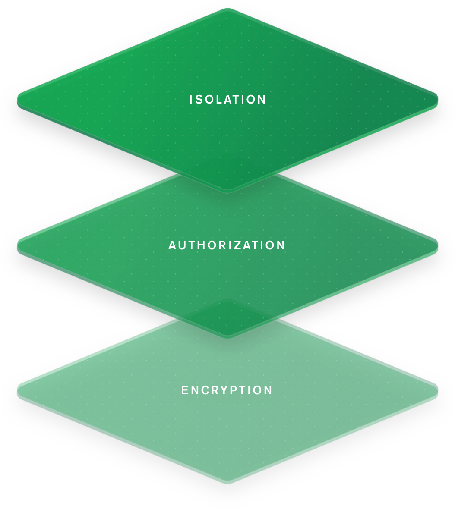

# Security

## Password policy (Requiring 10 characters minimum)

Necessary and strong password policy.

## 2FA - Two factor authentication

Authentication taken to the next level with two factor authentication.

 
    

    
    

 

## Client side encryption

Powerful encryption on Client side.

## Mongodb encryption + replica set (2 locations)

All the data is encrypted on the data base and the data is kept in two different locations.

Also the data base can migrate to BV data base later and with access to the API the app can fetch and push data.

 
    

    
    

 
 
    

    
    

 