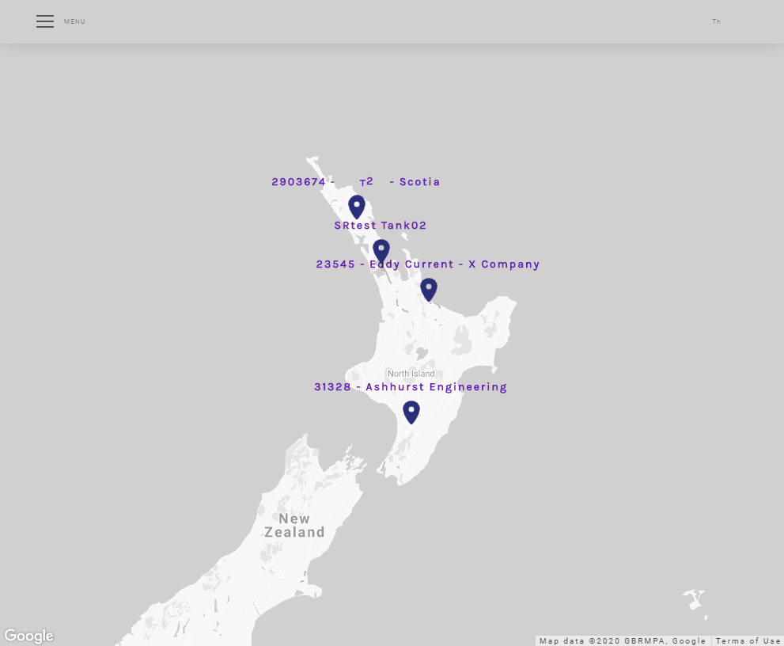
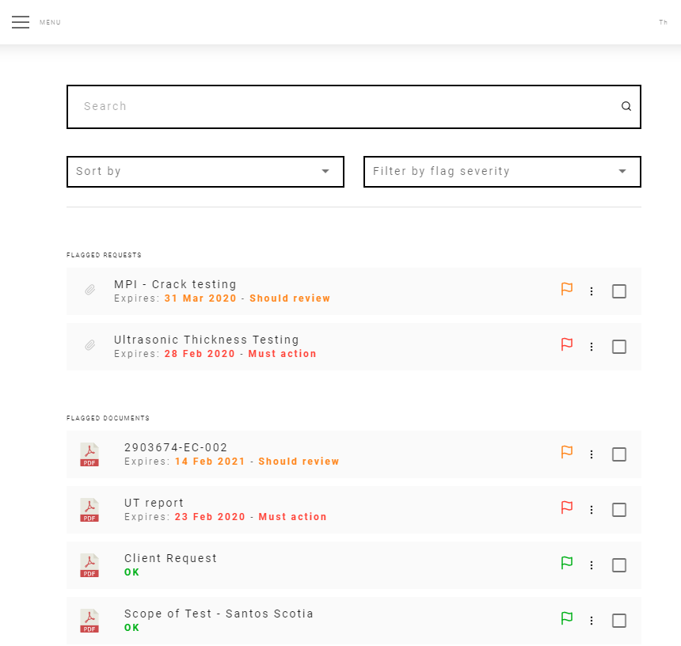
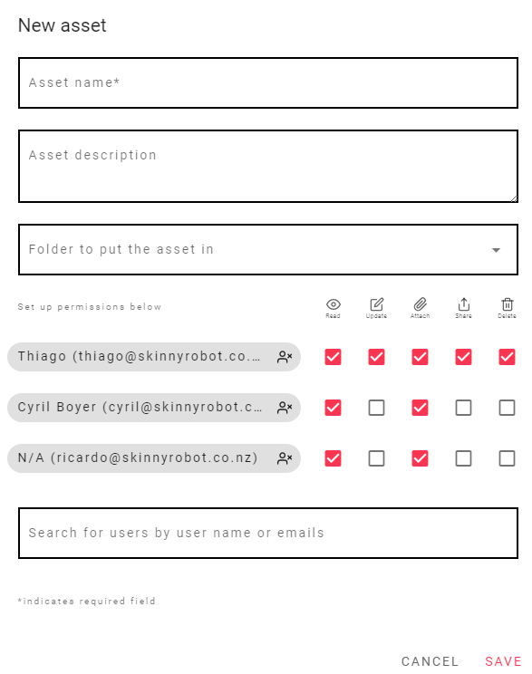

<Noprintmenu/>

## QR code made easy

| Scan the QR code...   |   Check the Asset Page...  |
|:---:|:---:|
|     |    |

### Done!!! Have all your documents at your hands, and everybody else's. Live!

## At any Device!

 
    

    
    

 

## Map View

At the Map view Page you can find all your assets and with a single click you can go direct to the asset.

 
    

    
    

 

### GPS Location

Finding an Asset is very easy an intuitive. 

To set a new location for your asset search the location using the search box, then just click on the map to set the location.

### Get Directions

You can also get directions for the Asset location, once It's defined. Just click on the Get Directions button on the bottom right corner.

### Set the location from your cell phone

Send your current location with your cellphone quick and easy, just click the "Set to current location" button.

## All Documents on the same Spot 

At the documents page you can see all the documents that you have access.

You can also sort them by flag severity, name or expire date.

If you like you can filter them by flag and you can search for any document at the search bar as well.

 
    

    
    

 
 
A document can be a photograph, a pdf drawing, a pdf report, a word file, a certificate, etc...

They will be attached to the Asset and only who has permission can have access to them.

You can invite someone to have access to only one document of an Asset if you like, so only relevant information will be shared.

## Define all your permissions

You can also choose what kind of permission and who is going to be allowed.

You can search users by user name or email on the text box.

After you added the user just click on the checkboxes and choose the kind of permission. 

::: tip
You can give permissions to multiple users at the same time.
:::

 
    

    
    

 

## And much more to come...

### Jobs

### Equipment Calibration

### Personnel Certificates

### This is just the beginning 
